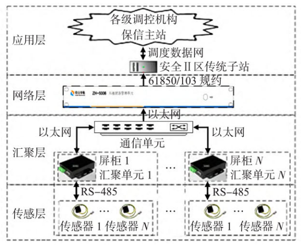
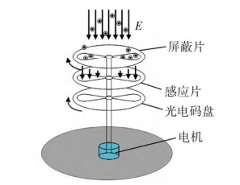
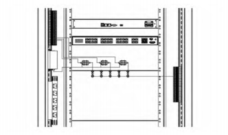
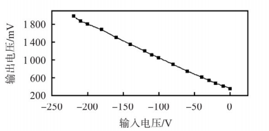
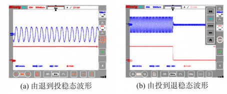

# 直流电场感应的非侵入式出口硬压板状态检测
>  * 2023年第42卷第6期
>  * 传感器与微系统（Transducer and Microsystem Technologies）
>  * 161
>  * D0I:10.13873/J.1000-9787(2023)06-0161-03
>  * 杨远航'，杨桥伟'，石恒初'，李本瑜'，张文斌²，游昊²
>  * （1.云南电力调度控制中心，云南昆明650000； 2.昆明理工大学机电工程学院，云南昆明650504）
>  * 摘要：针对现有压板不具备状态监测和测量电量功能，以及接触测量会影响二次回路等问题，提出了种非接触式在线智能检测方法和监测系统。利用直流电场感应原理，在被测硬压板无工频变化、无电流通过的情况下，根据非接触式测量方式检测硬压板次级触电背部接线电压信息来判断出口压板的投/退状态，实现了对压板状态的监测。介绍了该系统组成单元功能和出口硬压板直流电场检测传感器的测量方法，解决了现有检测方式无法识别压板“假投入”的问题,现场实验验证表明,所提检测方法安全、有效。关键词：出口压板；非侵人式；直流电场；智能检测
>  * 中图分类号：TP212；TM835
>  * 文献标识码：A
>  * 文章编号：1000-9787(2023)06-0161-03

# Non-intrusive state detection of outlet hard pressing plate by DC electric field induction

> * (1. Yunnan Power Dispatching Control Center , Kunming 650000, China; 2. School of Mechanical and Electrical Engineering, Kunming University of Science and Technology , Kunming 650504, China)
> * Abstract: Aiming at the problems that the existing pressing plate does not have the function of condition monitoring and electric quantity measuring,and the contact measurement will affect the secondary circuit, a non contact online intelligent detection method and monitoring system are proposed. Using the DC electric field induction principle, under the condition of no power frequency change and no current passing through the measured hard strap,the input/output status of the outlet strap is determined by detecting the wiring voltage information of the back of the secondary electric shock of the hard strap according to the non-contact measurement method, and the monitoring of the strap status is realized. The functions of the system components and the measurement method of the DC electric field detection sensor of the export hard plate are described,the problem that the existing detection methods can not identify the " false input" of the platen is solved. The field experimental verification shows that the proposed detection method is safe and effective
> * Keywords: outlet pressing plate; non intrusive; DC electric field; intelligent detection

## 0 引 言

硬压板广泛应用于电力系统继电保护和自动装置等电力二次设备出口回路中[1]，作用是在保护装置出口跳闸或自动装置出口控制回路中增加可人工操作的回路断点，可实现保护或自动装置回路的人工操作，确保保护或自动装置回路可靠断开。随着二次远程运维模式推进，对现场二次设备出口硬压板的远方监视变得愈发迫切，而实现硬压板远方监视的基础在于准确检测其投/退状态[2,3]。目前，普遍采用通过位置传感器、双联压板等表征压板姿态信息的方式来检测压板投/退状态,文献[4]提出一种变电站保护出口压板状态的电量监测技术,通过在操作回路的出口压板两侧并入2个电压型继电器,并基于设定的判别逻辑，实现出口压板状态的综合判断。文献[5]提出了智能变电站继电保护系统的构成，给出了软件总体结构以及各个主要功能模块,并完成了系统各个分界面的设计。文献[6]设计了断路器操作回路的智能化监测系统,其中涉及回路压板状态监控。文献[7]研究了继电保护和自动装置压板回路远方控制技术。以上文献分别从压板状态监测、压板状态控制和压板状态识别等角度进行了分析,在一定程度上解决了传统方式中依靠人工巡检方式对压板状态实时监视的困境,但是各方案归根到底,仍然只是一种“姿态”的监视,未能真正实现压板“投/退”对应回路“通/断”的本质监视,无法规避由于人员误操作、压板质量问题、回路松动等原因导致的压板虽在“投入”但回路却处“断开”状态的“假投入”检测盲区。

鉴于此,本文提出了一种新的出口压板非侵入式在线检测方法与智能监测系统,**该方法利用压板“投/退”状态下对应的出口回路直流电位变化特征**,通过直流电场感应原理[8],在被测硬压板次级触点接线中,利用非侵入方式检测硬压板次级触点背部接线电压信息,判断硬压板的投/退状态以及出口回路通/断状态,从根本上解决了上述所遇到的问题,进一步消除电力二次设备出口压板“假投入”隐患。

## 1 压板在线状态监测系统的结构与工作原理
## 1.1 压板在线状态监测系统结构
本文设计的出口压板状态在线智能监测系统主要由传感层、汇聚层、网络层、应用层构成，如图1所示:

1)**传感层**：在硬压板次级触点背部接线位置安装直流电场检测传感器；

2)**汇聚层**：安装数据采集终端压板状态汇聚单元；

3)**网络层**：安装压板状态管理单元，集中监测多个出口压板状态，通过通信交换机与保存子站单向通信；

4)**应用层**：保存子站单向实时接收压板位置信息，并上送到各级调控机构保信主站。

图 1 压板在线状态监测系统结构
## 1.2 压板投/退状态检测原理
在传统的各种电力二次设备中，以继电保护设备为例，压板用以接通或断开某个二次回路，压板两端的接线一端将连接负电位，一端为悬空接线，连接保护装置动作接点。本文提出了非侵入式压板状态监测传感器，其原理是伴随着压板的投/退状态，悬空接线的一端将出现“得电”或“失电”，主要表现为直流电压的通/断（非电流），来表征为电学参量—电场（电荷）的有无，具体为：

* 当压板退时，下端子电压为0 V；
* 压板投切时，下端子电压为-110 V

因此，传感器需安装在下端子位置，实现直流电场的非接触测量[9]。

## 2 非侵入式硬压板在线状态监测传感器
## 2.1 直流电场传感器
工作原理基于静电场中的高斯定理[10]
$$
\oint\limits_{S}\vec{E}\mathrm{d}\vec{S}=\frac{1}{\varepsilon_{0}}\sum_{s} q \quad (1)
$$
式中 $S$ 为真空中的任意闭合曲面； $ \vec{E} $ 为真空中的电场强度；$\varepsilon_{0}$  为真空介电常数；$q$ 为该曲面中的自由电荷。
图2为场磨式电场传感器的结构示意。场磨式电场传感器应片上产生周期性的感应电流 $i(t)$，感应**电流的幅值**大小和被测的**电场**具有**线性关系**
$$
i(t)=(\mathrm{d}\sum_{s}q)/\mathrm{d}t=\varepsilon_{0}E\mathrm{d}A(t)/\mathrm{d}t \quad (2)
$$

式中 $A(t)$ 为感应片暴露于被测电场中的总面积；$ \varepsilon_{0}$为空气介电常数；$\vec{E}$ 为被测电场强度。

图 2 场磨式直流电场传感器测量原理
如图 2 所示, 传感器的屏蔽片接地, 在激励电压驱动下带动屏蔽片周期性屏蔽、暴露感应片, 感应片表面的感应电荷量周期性改变, 产生感应电流, 此电流幅值与被测电场幅值成正比, 测量此电流值即可达到测量被测电场的目的。

## 2.2 传感器单元安装位置
传感器通信接口端子通过  \( $4 \times 0.2$ \)  平屏蔽线缆与压板状态汇聚单元相连，压板直流电场检测传感器为长方形外观，采用直流电场感应原理，感知压板次级触点接线上电压变化，并将对应的变化数据通过 RS-485 总线上传至压板状态汇聚单元，由压板状态汇聚单元将协议报文发送至压板状态管理单元；压板状态管理单元基于此信息判断压板投/退状态。
当被测硬压板处于联通状态时，压板次级触点接线上产生电压，但此时线缆中不一定有电流，压板直流电场检测传感器通过检测直流电场强度，将其转化为对应的正值数据。当被测硬压板断开时，压板次级触点接线上电压也随之消失，压板直流电场检测传感器检测直流电场强度衰减，将其转化为对应的负值数据，通过压板直流电场检测传感器上传对应的变化数据，压板状态管理单元便可精确地判断压板的投/退状态。
在现场施工过程中,将被测硬压板次级触点接线引入传感器线槽中,通过扎带将传感器与被测硬压板次级触点接线捆绑在一起,保证被测硬压板次级触点接线与传感器检测电极紧密贴合,以便压板直流电场检测传感器能够准确检测到被测硬压板次级触点接线中的电场变化。出口压板直流电场检测传感器如图3所示。

图3 出口压板直流电场传感器安装示意

## 2.3 传感器的线性特征
如图4所示，传感器在-220~0V的线性误差小于1.5%。

图4 传感器的线性特征

## 3 实验验证

将示波器**探头1连接传感器输出信号**，探头2连接下压板，可以同时记录压板投/退状态波形。由于示波器探头连接下压板，压板退时，探头相当于高阻接地，起到了放电作用。正常工况下,压板退时，下压板回路是悬空状态,并连接了继电保护装置。当直流电场传感器检测到电场信号时,压板可进行由退到投的操作。**图5(a)为测试所得的稳态波形**；同理，当传感器检测到**电压信号进行由投到退的动作时，传感器检测到的瞬态和稳态波形如图5(b)**所示。

图5 压板由退到投和由投到退稳态波形

本文对下压板不连接示波器进行了投/退实验，2组实验对比结果如表1所示。针对多个样本进行重复测试，分别检测压板状态判别过程中的检测、成功、错检、漏检次数。得到结果如表2。

表1 下压板连接与断开示波器的投/退实验对比

| 状态  | 下压板连接示波器             | 下压板不连接示波器                |
| ----- | ---------------------------- | --------------------------------- |
| 退→投 | 传感器输出快速增大，响应迅速 | 传感器输出快速增大，响应迅速      |
| 投→退 | 波形快速减少，响应迅速       | 波形缓慢减少（衰减50%，需要20s)。 |

表2 压板投/退识别结果

| 传感器个数 | 检测次数 | 成功次数 | 错检次数 | 漏检次数 |
| ---------- | -------- | -------- | -------- | -------- |
| 1          | 300      | 300      | 0        | 0        |
| 2          | 300      | 300      | 0        | 0        |
| 3          | 300      | 300      | 0        | 0        |
| 4          | 300      | 300      | 0        | 0        |

由表1可知投/退状态可以明显区分,区分程度大于3倍，可以很好地分辨压板的投/退状态。

## 4 结论

通过检测结果表明：本文所提出的压板状态识别方法能够适应于现场工程应用实践，可有效解决压板位置状态。

## 参考文献

[1］郑秋元，王世浩，蔡仁源，等.基于物联网传感技术的二次回路出口压板智能在线监测系统[J].电气应用,2022,41（6)： 74-80.
ZHENG Qiuyuan, WANG Shihao, CAI Renyuan,et al. Intelligent online monitoring system for secondary circuit outlet pressing plate based on Internet of Things sensing technology[J]. Electri-cal Application,2022,41(6) :74 -80
[2］吉瑞.变电站压板在线状态监测系统的应用[J].电力安全技术,2016,18(2):31-33.
JI rui. Application of online status monitoring system for substa-tion pressing plate[ J]. Power Security Technology ,2016 ,18(2) : 31-33.
[3］唐立军，周年荣，方正云，等.基于MEMS电场传感器的直流验电器系统设计[J].传感器与微系统,2019,38（9）：77-80. TANG Lijun,ZHOU Nianrong, FANG Zhengyun,et al. Design of DC electroscope system based on MEMS electric field sensor[ JJ. Transducer and Microsystem Technologies ,2019,38(9) :77 -80.
[4］徐浩,欧阳帆，梁文武，等.变电站保护出口压板状态的电量监测技术研究[J].湖南电力,2018,38(1)：38-41.
XU Hao, OUYANG Fan, LIANG Wenwu, et al. Research on the electricity monitoring technology for the state of the protective outlet pressing plate of the substation[ JJ. Hunan Electric Power, 2018,38(1):38 -41.
[5］李然，金元元，钟丽波，等.变电站硬压板状态在线监测功能研究[J].东北电力技术，2015,36（8）：54-56,59
LI Ran, JIN Yuanyuan,ZHONG Libo,et al. Research on online monitoring function of substation hard strap status[J]. Northeast Power Technology ,2015,36(8) :54 -56,59.
[6］潘建亚.智能变电站继电保护状态监测装置的研制［D].南京：东南大学,2017.
PAN Jianya. Development of intelligent substation relay protection status monitoring device [ D ]. Nanjing: Southeast University, 2017.
[7］李永丽,李瑞鹏，卢扬，等.断路器操作回路的智能化监测系统设计[J].电力自动化设备，2017,37（10）：211-217.
LI Yongli, LI Ruipeng, LU Yang,et al. Design of intelligent moni-toring system for circuit breaker operation circuit [J]. Power Automation Equipment,2017,37(10) :211 -217.

[8］侯杰，吴桂芳，崔勇，等.硅基微型静电谐振式直流电场传感器建模与仿真分析［J].中国电机工程学报,2021,41（1）： 374-382,426.
HOU Jie, WU Guifang, CUI Yong,et al. Modeling and simulation analysis of silicon based micro electrostatic resonant DC electric field sensor[ JJ . Chinese Journal of Electrical Engineering,2021 , 41(1):374-382,426.
[9］周年荣,方正云，唐立军，等.高压近电预警用工频电场传感单元设计与分析［J].传感器与微系统，2019,38（10）：89-91,95.
ZHOU Nianrong, FANG Zhengyun, TANG Lijun, et al. Design. and analysis of power frequency electric field sensing unit for high voltage near electric warning [ J]. Transducer and Microsystem
Physiology ,2002 ,22(15 -16) :1125 -1136.
[10］崔勇,漆旭平,吴桂芳，等.基于悬空场磨的空间直流合成电场测量研究[J].中国电机工程学报,2020,40（S1）：343-352
CUI Yong, QI Xuping, WU Guifang, et al. Research on measure-ment of space DC synthetic electric field based on suspended field mill[ J]. Chinese Journal of Electrical Engineering, 2020, 40( S1) :343 -352.

## 作者简介

杨远航（1990一），男，硕士，工程师,研究领域为电力系统继电保护技术。
杨桥伟（1987一）,男，高级工程师，研究领域为继电保护及其二次回路技术。
张文斌(1976一）,男，通讯作者，博士，副教授，主要研究领域为测控技术及仪器，智能传感器。

